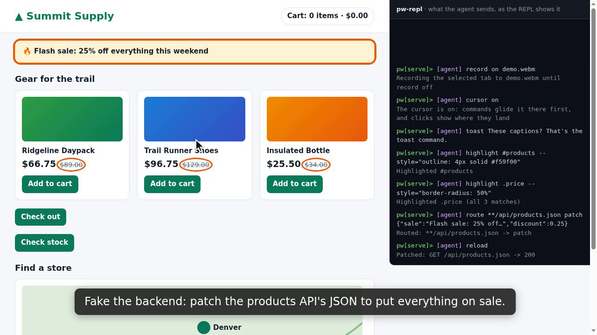

# pw-repl

A Playwright REPL for driving Chromium from the command line, made to be shared by you and your AI
agents.

pw-repl connects to a Chromium over CDP (the Chrome DevTools Protocol), in the browser you already use or
in one it starts itself. You type commands at a `pw>` prompt. Agents send the same commands from a shell
with `pw-repl send`. Every command shows in the REPL, whoever sent it, so you always see what an agent
is doing in your browser, and the agent can see what you did.

[](docs/pw-repl-demo.webm)

A 90-second demo (click to play), recorded by pw-repl itself from one script of commands. The command
panel on the right is part of the demo page, showing what the agent sends.

```text
pw> tab new http://localhost:3000/cart
pw> snapshot                            # the page by role and name, with [ref=eN] labels
pw> click e7                            # click by ref, or by any Playwright selector
pw> requests                            # what the page requested
pw> body 4                              # what one request got back
pw> route **/api/cart 500 {"error":"boom"}   # fake a failing backend
pw> reload
pw> console error                       # and see how the page copes
```

## Why use it

- **Your browser, as it is.** It connects to a running Chromium, with your tabs, logins and state, and
  leaves it running when it stops. Nothing is reset to a fresh profile.
- **One session, seen by everyone.** You and any number of agents drive the same browser, each with a
  selected tab of its own, and every command shows in the REPL.
- **What you did, for an agent to read.** `watch` records each step you take in a tab, with the requests
  it caused. Reproduce a bug by hand and the agent sees exactly what happened. `watch save` keeps the
  steps as a file of commands that runs them again.
- **Breaking things on purpose.** Fake, patch, delay or fail responses, cut or slow the network, emulate a
  phone, a locale or a timezone. All of it applies to one tab, so your other tabs are left alone.
- **Videos that explain themselves.** Record a tab with a pointer that glides to each click, captions on
  screen, boxes around what matters, and pacing for a viewer.

## What it can do

- **Read the page:** accessibility snapshots with clickable refs, text, HTML, attributes, links, form
  controls, event listeners, screenshots (viewport, full page or one element).
- **Act on it:** click, fill, type, press keys, select, check, upload files, move the mouse, scroll the
  wheel, answer dialogs.
- **Watch the network:** every request and response body, console messages and page errors, all recorded
  as they happen.
- **Change the network:** fake a response (`route`), patch its JSON, delay it, fail it, or cut or slow the
  whole tab's network.
- **Emulate:** a phone, dark mode, a locale, a timezone, a viewport size.
- **Run code:** `eval` any JavaScript in the page, or send a raw CDP command with `cdp`.
- **Wait:** for an element, some text, a response or a page load.
- **Record:** what someone does in a tab (`watch`), a timeline of requests and console (`capture`), or a
  video of the tab (`record`), with a virtual pointer (`cursor`), captions (`toast`) and highlights
  (`highlight`).
- **Share:** many clients on one REPL, each with its own tab; a command server on a Unix socket or a local
  port, with an HTTP+JSON protocol.

## Quick start

You need Node.js 20 or newer. pw-repl can use a Chromium-based browser you already have (Chrome,
Chromium, ...), or Playwright's own: `npx playwright-core install chromium` downloads it.

```bash
npx pw-repl@latest run --launch https://example.com
```

`--launch` starts a private headless Chromium for the REPL and stops it when the REPL quits. Add
`--headed` to see that browser and click in it yourself. The page opens in a new tab, and a `pw>`
prompt waits:

```text
pw> help                          # common tasks and topics; help <topic>, help <command>, help --all
pw> snapshot
pw> click e3
pw> screenshot
pw> quit
```

Commands act on the selected tab. `tab` lists the tabs, with `*` on the selected one.

### Install

| How          | Setup                                        | Then run                       |
| ------------ | -------------------------------------------- | ------------------------------ |
| Without      | nothing                                      | `npx pw-repl@latest <command>` |
| Global       | `npm install -g pw-repl`                     | `pw-repl <command>`            |
| From a clone | `npm install` (and `npm link` for `pw-repl`) | `bin/pw-repl.js <command>`     |

With `npx`, use `npx pw-repl@latest` the same way every time, so every command runs the same version.

## Use your own browser

Start Chrome with remote debugging, then run the REPL without `--launch`:

```bash
chrome --remote-debugging-port=9222 --user-data-dir="$HOME/.config/chrome-debug"
pw-repl run              # connects to localhost:9222
```

Use a separate `--user-data-dir`: recent versions of Chrome do not open the debugging port on the default
profile. To check that it is up: `curl http://localhost:9222/json/version`. To reach a browser on
another port or machine, set `PW_CDP_URL=http://host:9222`.

A headless Chrome works the same way (`chrome --headless=new --remote-debugging-port=9222
--user-data-dir=/tmp/chrome-headless`). Nobody can click a headless browser's dialogs, so answer them
with `dialog accept` or `dialog dismiss`. Its pages start at about 800x600; `viewport 1280x800` changes
that.

**Browser on the host, REPL in a container:** with host networking, `localhost:9222` reaches the host's
browser directly. Otherwise, set `PW_CDP_URL` to the host's address as the container sees it (for
example the Docker bridge gateway, `ip route | awk '/default/ {print $3}'`).

## Ways to run it

| Command                      | What you get                                                                       |
| ---------------------------- | ---------------------------------------------------------------------------------- |
| `pw-repl run`                | a prompt in this terminal; `send` reaches it only through a tmux session `pw-repl` |
| `pw-repl serve`              | a prompt (`pw[serve]>`), plus a command server on `/tmp/pw-repl.sock`              |
| `pw-repl serve --background` | no terminal; output in `/tmp/pw-repl.log`                                          |

- `pw-repl attach` shows a background REPL and takes commands, from any terminal. `pw-repl stop` stops
  it. `pw-repl where` says what is running and how `send` will reach it.
- For `send` to reach `run`, start it in tmux: `tmux new -s pw-repl`, then `pw-repl run` there.
- A URL after the command opens in a new tab: `pw-repl serve http://localhost:3000`.
- `--launch` works with each of them. Flags after `--` go to that Chromium.
- A REPL of your own goes on a socket of its own: `-e /tmp/mine.sock` on every command, `serve`
  included, or set `PW_SOCKET`. `serve <port>` listens on TCP, on 127.0.0.1 only.

## Common tasks

| I want to…                            | Commands                                                                             |
| ------------------------------------- | ------------------------------------------------------------------------------------ |
| see where I am                        | `tab` (it marks the tab you are looking at `(visible)`), `info`                      |
| see what is on the page               | `snapshot`, `screenshot`                                                             |
| do something on it                    | `click`, `fill`, `type`, `press`                                                     |
| click what has no selector (a canvas) | `mouseclick <x> <y>`                                                                 |
| run some JavaScript in the page       | `eval document.title`                                                                |
| wait for a page or element            | `wait load`, `wait <selector>`, `wait <selector> --gone`, `wait text <text>`         |
| choose a file in a file input         | `upload <selector> <file>`                                                           |
| see it as a phone, or in dark mode    | `emulate mobile`, `emulate dark` (also `emulate locale`, `emulate timezone`)         |
| see what the page requested           | `requests`, then `body <#>` for what one got back                                    |
| see console messages and errors       | `console`                                                                            |
| show an agent what I do               | `watch on`, click around in the browser, then `watch`                                |
| see each step as I click              | `watch on --live`                                                                    |
| replay what I clicked through         | `watch on`, click around, `watch save flow.txt`, then `pw-repl send --file flow.txt` |
| record requests and console together  | `capture on`, then `capture off`                                                     |
| fake a backend response               | `route <glob> <status> <json>`, `route <glob> abort`                                 |
| change or slow an API response        | `route <glob> patch <json>`, `route <glob> delay <secs>`                             |
| cut or slow the whole network         | `network off`, `network slow`, then `network on`                                     |
| record a video of the page            | `record on`, then `record off` (`help video` for a take with a pointer)              |
| show a pointer where the agent acts   | `cursor on`, then `cursor off` (in screenshots and videos)                           |
| say what is happening on screen       | `toast <text>`, then `toast off` (`--duration=3s` hides it by itself)                |
| point something out on the page       | `highlight <ref>` draws a box; `highlight off` hides it                              |
| clean up                              | `modes off`                                                                          |

`help <topic>` lists the rest, and `help <command>` has usage and caveats.

### Modes

Some commands turn on a mode that stays on until you turn it off: `watch`, `capture`, `route`, `network
off` or `slow`, `emulate`, `viewport`, `record`, `highlight`, `cursor` and `toast`. While any are on in
the selected tab, the prompt shows them: `(watch network:off routes:2) pw>`. `modes` lists them for every
tab, and `modes off` turns them all off. Each of these commands on its own shows its state and what you
can run next.

## For agents and scripts

### A skill for agents

`pw-repl skill` prints an agent skill (`SKILL.md`) that teaches an agent to use the REPL: how to start
it, send commands, and share the browser with the user. Save it as `pw-repl/SKILL.md` in the folder
your agent reads skills from:

```bash
mkdir -p <skills folder>/pw-repl
npx pw-repl@latest skill > <skills folder>/pw-repl/SKILL.md
```

It is stamped with the version it came from and a hash of its text. `pw-repl where` names the skill of
the pw-repl being run, so an agent can tell when its saved copy is out of date and offer to update it
(keeping its Custom rules section).

### send, clients and where

```bash
pw-repl send info
pw-repl send help       # the REPL's commands; works without a running REPL
pw-repl where           # which REPL send would reach
```

`pw-repl send` sends one command and prints its result, through the server when one is running, and
through the `pw-repl` tmux session otherwise. Chain several in the shell: `&&` stops at the first that
fails or is not confirmed (exit 1 or 2), and `;` carries on.

Several agents can share one REPL. `pw-repl send -c <name>` (or `PW_CLIENT=<name>`) sends as a client
with a selected tab of its own, shown in the REPL as `[server:<name>]`. `modes` says which client turned
each mode on, and `modes off --mine` turns off only the sender's own.

`send --file take.txt` runs a file of commands, one per line, and stops at the first that fails: a
repro to keep, or a video take.

**Passwords:** type one as a variable: `PW_PASSWORD=... pw-repl send fill '#password' "{{ PW_PASSWORD
}}"`, or the same line in a file run with `send --file`, as `watch save` writes it. `send` passes the
value along with the command, and the REPL puts it in only as it runs the command, so the file, the
REPL's output, its log and its history never hold it. Output that reads it back can: `snapshot`, `html`
and `attrs` hide a password field's value, but `eval` on the field, a field that a Show password button
made plain text, or page text that repeats it do not. Only `PW_` names are variables.

### The HTTP protocol

With `pw-repl serve`, the server speaks HTTP with JSON, for clients of your own:

```bash
curl --unix-socket /tmp/pw-repl.sock -H 'Content-Type: application/json' \
  -d '{"command": "info"}' http://localhost/run
```

The body may also have `"client": "<name>"`, and `"vars": {"PW_NAME": "<value>"}` with the values of the
`{{ PW_NAME }}` variables in the command (one line only, else 400). It returns `{"status": "ok" |
"error", "output": "..."}`, plus `"unconfirmed": true` when the command may or may not have done what it
was sent to do (it timed out, or the REPL quit while it ran and it was not read-only). While the REPL
starts, `/run` answers 503 with `"starting": true`: retry. `GET /health` says `"status": "starting"` until
it serves, then `"ok"`. `pw-repl serve <port>` serves TCP on 127.0.0.1; other addresses are refused.

## How it differs from playwright-cli

[playwright-cli](https://github.com/microsoft/playwright-cli) is Microsoft's command line for agents. It
gives each agent a browser session of its own, while pw-repl shares one browser between users and agents.
playwright-cli's command names and most of their options work here too (`help playwright-cli` lists
them). Where pw-repl differs, it is mostly because someone else may be using the browser:

- `open` and `close` open a tab and turn off your modes; they never start, close or wipe a browser.
- Routes, network and emulation apply to one tab, not the whole browser.
- File pickers are not caught, since they may be the user's: `upload` names the input instead.
- There is no snapshot after every command, since the user reads the REPL too; `snapshot` shows one.
- Instead of `-s=<session>`, an agent is a client of its own (`send -c <name>`).
- `watch` records what the user does as steps with their requests, and `watch save` writes them as
  pw-repl commands to run again, not as Playwright code.
- `highlight` draws its box without Playwright's locator label, which would cover what is below it and
  put selectors in screenshots and videos. `highlight --labels on` shows it.

For a browser of its own for each agent, isolated sessions, traces, PDFs or generated test code,
playwright-cli is the better fit. `record` records a tab's page; to record the shared browser as you see
it, with your real pointer, use a screen recorder (OBS, `ffmpeg -f x11grab`, macOS `screencapture -v`).

## Contributing

`AGENTS.md` describes how the code is laid out, how to add a command, and how releases are cut.

```bash
npm install
npm test
```

The tests need Node.js 21 or newer. They run against a private headless Chromium they start themselves
(`PW_TEST_CHROME`, or the one `--launch` would use: Playwright's, then one on the `PATH`) and a local test
site. The browser tests are skipped when no Chromium is found.

## License

MIT. See `LICENSE.md`.
